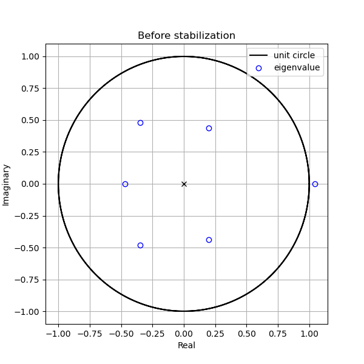
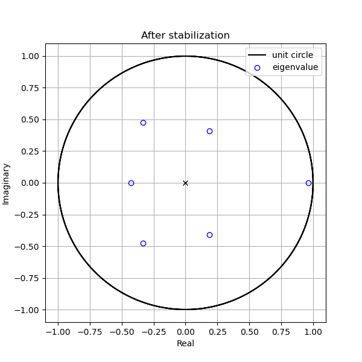
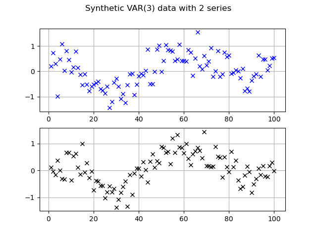

# Sythetic Vector AutoRegressive (VAR) data generator

This repository produces a VAR(p) synthetic data **generator**. \
`p` denotes the variable's lagged values and can be any positive *integer* value. \
The **number of series**, $N$, can be any positive integer value as well.

## Requirements 📚

This repository has been created with Python *version 3.8.8.*

### Libraries
[NumPy](https://numpy.org/) \
[matplotlib](https://matplotlib.org/)

## Formal definitions 👓

In its basic form, a VAR **model** consists of a set of $N$ **endogenous** (a variable in a statistical model that is changed or determined by its relationship with other variables within the model) variables. \
After including $p$ lags of the endogenous variables the VAR(p) model, at step $t$, can be defined as:

$$ \bm{y}_t = \bm{A}_1 \bm{y}_{t-1} + \dots + \bm{A}_p \bm{y}_{t-p} + \bm{C}\bm{D}_t + \bm{u}_t $$

where $\bm{A}_i \in \mathbb{R}^{N\times N}$ for all $i\in[1,p]$ are coefficient matrices and $\bm{u}_t$ is a $N$-dimensional white noise process satisfying $\mathbb{E}[\bm{u}_t]=0$ and $\mathbb{E}[\bm{u}_t\bm{u}^\top] \geq 0$.

The matrix $\bm{C}\in\mathbb{R}^{N\times M}$ is the coefficients matrix of $M$ **deterministic regressors**.

Finally, $\bm{D}_t\in\mathbb{R}^M$ is a column vector containing the deterministic regressor values, e.g. constant, linear trend, etc.

### The companion form

It is possible to express any VAR(p) model in a VAR(1) form:

$$ \bm{Z}_t = \bm{\Gamma}_0 + \bm{\Gamma}_1 \bm{Z}_{t-1} + \bm{U}_t$$

with 

$$\bm{Z}_t = 
\begin{bmatrix} 
\bm{y}_t \\ \bm{y}_{t-1} \\ \dots \\ \bm{y}_{t-p+1} 
\end{bmatrix} \in \mathbb{R}^{pN}$$

$$ \bm{\Gamma}_0 = 
\begin{bmatrix}
\bm{C}\bm{D}_t \\ \bm{0} \\ \dots \\ \bm{0}
\end{bmatrix} \in \mathbb{R}^{pN}$$

$$ \bm{U}_t = 
\begin{bmatrix}
\bm{u}_t \\ \bm{0} \\ \dots \\ \bm{0}
\end{bmatrix} \in \mathbb{R}^{pN}$$

and 

$$ \bm{\Gamma}_1 = 
\begin{bmatrix}
\bm{A}_1 & \bm{A}_2 & \dots & \bm{A}_{p-1} & \bm{A}_p \\
\bm{I} & \bm{0} & \dots & \bm{0} & \bm{0} \\
\bm{0} & \bm{I} & \dots & \bm{0} & \bm{0} \\
\vdots & \vdots & \ddots & \vdots & \vdots \\
\bm{0} & \bm{0} & \dots & \bm{I} & \bm{0} 
\end{bmatrix} \in \mathbb{R}^{pN \times pN}$$

### Stability in a VAR model

The VAR model is stable when the effects of the **shocks**, $\bm{u}_t$, disipate over time. \
This will be the case if the *eigenvalues* of the companion-form matrix $\bm{\Gamma}_1$ are less than $1$ in module.

From **induced norms** if the sum of absolute values of the elements in a row/colum  for each row/column is less than $1$, then $|\lambda_i| \leq 1$ for all $i \in [1,pN]$.

> **NOTE**:\
The infinite induced norm returns the absolute row sum of the matrix, i.e.
> $$ \Vert \bm{\Gamma} \Vert_{\infty} = \underset{i\leq i \leq pN}{ \text{max}} \sum^{pN}_{j=1} | \gamma_{i,j} |$$

> **NOTE**:\
The spectral radious of a square matrix is the largest absolute value of its eigenvalues
> $$ \rho(\bm{\Gamma}) \leq \Vert \bm{\Gamma}^r \Vert^{\frac{1}{r}} $$
> for any $r\in\mathbb{N}$ (in our case $r=1$).

Therefore we can enforce the stability of the VAR model by scaling the model parameters such that the sum of absolute values of the elements in the first $N$ rows of the companion-form matrix $\bm{\Gamma}_1$ are less than 1.

> **NOTE**: for an arbitrary matrix, we may not have equality (strict inequality) for any norm. \
This is what we are looking for. \
This statement does not guarantee anything but supports the use of the infinite induced norm. 

## Insights 🍿

You can find an example of how to generate VAR(p) synthetic data in the file `example.py`.

To run the example, once you are inside the repository, type
```
python example.py
```

You can either generate a random VAR model generator or once created you can modify its parameters and **stabilize** the model again.

This is an example of the eigenvalues of the companion-form matrix before and after stabilization for a VAR(3) with $N=2$:




 
Lastly, the synthetic data generated looks like:



> **NOTE**: The code produces a VAR data **generator**. That means that the sysnthetic data is produced in a way that is suitable for online learning as well as batch learning methods without further modifications.

## Citing 🎓

If you find this repository useful, please consider to **cite** the article(s) for which it has been created

```
@inproceedings{ruiz2021tracking,
  title={Tracking of Quantized Signals Based on Online Kernel Regression},
  author={Ruiz-Moreno, Emilio and Beferull-Lozano, Baltasar},
  booktitle={2021 IEEE 31st International Workshop on Machine Learning for Signal Processing (MLSP)},
  pages={1--6},
  year={2021},
  organization={IEEE}
}
```

```
@article{ruiz2022zero,
  title={Zero-delay Consistent and Smooth Trainable Interpolation},
  author={Ruiz-Moreno, Emilio and L{\'o}pez-Ramos, Luis Miguel and Beferull-Lozano, Baltasar},
  journal={arXiv preprint arXiv:2203.03776},
  year={2022}
}
```